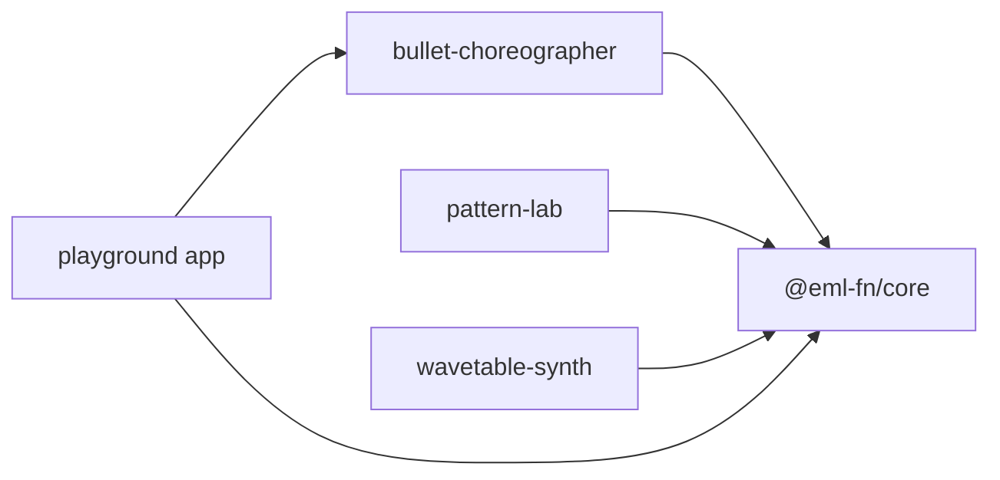

# eml-fn

[](https://github.com/grzott/eml-fn/actions/workflows/ci.yml)
[](LICENSE)

TypeScript libraries for the **EML (Exp-Minus-Log) function**: `eml(x, y) = exp(x) - ln(y)`.

A single binary operator that generates every continuous function through composition — like a functional NAND gate. Based on [arXiv 2603.21852v2](https://arxiv.org/abs/2603.21852v2) by Andrzej Odrzywołek.

## Packages

| Package | Status | Description |
|---------|--------|-------------|
| [`@eml-fn/core`](./packages/core) | ✅ Done | Tree data structures, evaluator, enumerator, 5 code generators |
| [`@eml-fn/bullet-choreographer`](./packages/bullet-choreographer) | ✅ Done | Bullet/particle trajectory generator for game dev |
| [`@eml-fn/pattern-lab`](./packages/pattern-lab) | ⬜ Next | WebGL shader art generator — enumerate & render 2D EML patterns |
| [`@eml-fn/wavetable-synth`](./packages/wavetable-synth) | ⬜ Planned | Wavetable synthesizer — EML waveforms via Web Audio API |



## Quick Start

```bash
bun add @eml-fn/core
```

```typescript
import { eml, evaluate, enumerate, toFormula, constNode, varNode, emlNode } from '@eml-fn/core';

// The fundamental operation
eml(1, 1); // ≈ e (Euler's number)

// Build a tree and evaluate it
const tree = emlNode(varNode('x'), constNode(1));
evaluate(tree, { x: 2 }); // ≈ 7.389 (e²)
toFormula(tree);            // "exp(x) - ln(1)"

// Enumerate all depth-2 trees (81 with 3 leaf types)
for (const t of enumerate(2, ['1', 'u', 'v'])) {
  console.log(toFormula(t));
}
```

### Bullet patterns

```typescript
import { generatePairsSampled, filterDegenerate, simulate, autoTag } from '@eml-fn/bullet-choreographer';

const pairs = generatePairsSampled(2, ['1', 't', 'i', 'n'], 5000);
const survivors = filterDegenerate(pairs);
const trajectory = simulate(survivors[0], 50, 200, 0.016);
const tagged = autoTag(survivors[0], trajectory);
console.log(tagged.tags); // ['wave', 'converge']
```

## Documentation

- [Architecture](./docs/architecture.md) — Monorepo structure, key decisions, Mermaid diagrams
- [EML Primer](./docs/eml-primer.md) — The math behind EML: derivation chain, trees, numerical concerns
- [Requirements](./docs/requirements.md) — Per-package P0/P1/P2 requirements with hazards
- [Phase Status](./docs/phase-status.md) — Build phase tracker

## Development

```bash
bun install        # Install all dependencies
bun run build      # Build all packages (tsup: ESM + CJS)
bun run test       # Run all tests (Vitest)
bun run lint       # Lint all code (Biome)
bun run lint:fix   # Auto-fix lint issues

# Playground app
cd apps/playground && bun dev  # → http://localhost:5173
```

### Toolchain

| Tool | Purpose |
|------|---------|
| [Bun](https://bun.sh) | Package manager, workspace orchestration, test runner |
| [tsup](https://tsup.egoist.dev) | Build: ESM + CJS dual output, .d.ts |
| [Vitest](https://vitest.dev) | Unit tests |
| [Biome](https://biomejs.dev) | Lint + format (replaces ESLint + Prettier) |
| [Changesets](https://github.com/changesets/changesets) | Version management + changelogs |
| [Vite](https://vite.dev) | Playground dev server + build |

## License

MIT
