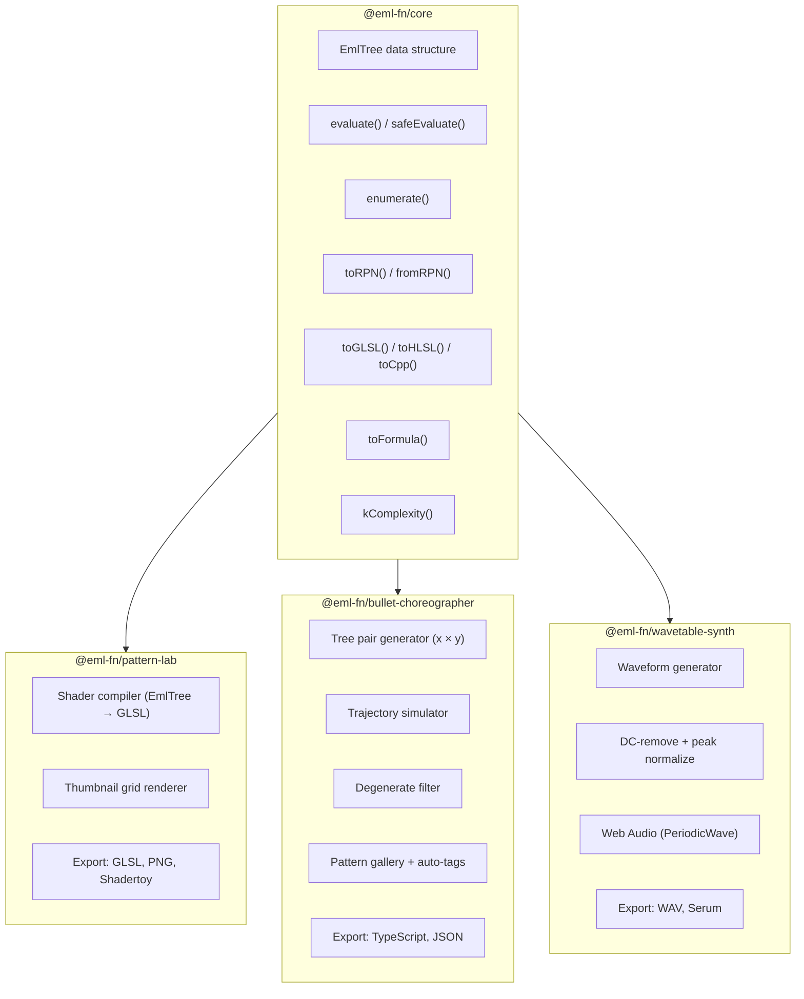
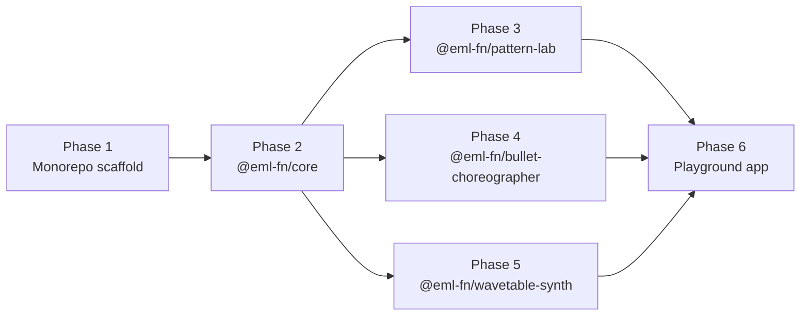

# Architecture Overview

The **eml-fn** monorepo contains 4 npm packages built around the EML (Exp-Minus-Log) function.

$$\operatorname{eml}(x, y) = e^x - \ln y$$

Paper: [arxiv.org/abs/2603.21852v2](https://arxiv.org/abs/2603.21852v2)

---

## Package Dependency Graph

## Package Purposes

| Package | npm name | Purpose |
|---------|----------|---------|
| Core | `@eml-fn/core` | Tree types, evaluator, enumerator, serialization, codegen backends |
| Pattern Lab | `@eml-fn/pattern-lab` | WebGL shader art — EML trees → GLSL fragment shaders → 2D patterns |
| Bullet Choreographer | `@eml-fn/bullet-choreographer` | Game dev — pairs of EML trees define bullet/particle trajectories |
| Wavetable Synth | `@eml-fn/wavetable-synth` | Audio — EML trees → waveforms → Web Audio PeriodicWave playback |

## Build Phases

Phases 3, 4, 5 are independent — can be built in any order.

## Key Decisions

These are final and should not be re-debated:

1. **Bun** — package manager AND runtime
2. **tsup** — ESM + CJS dual output builds
3. **Vitest** — test runner (ecosystem compat, runs via `bun run`)
4. **Biome** — lint + format (replaces ESLint + Prettier)
5. **Changesets** — versioning + publishing
6. **MIT** license
7. **`@eml-fn`** npm scope
8. **Core has zero runtime dependencies**
9. App libs depend ONLY on core — no cross-dependencies between pattern-lab, bullet-choreographer, wavetable-synth
10. React components via optional sub-export (`@eml-fn/<pkg>/react`), React is `peerDependency`
11. TypeScript strict mode everywhere
12. Target ES2022+ (modern browsers, Bun/Node 18+)

## Toolchain

| Tool | Config file | Purpose |
|------|------------|---------|
| Bun | `bunfig.toml` | Package manager, script runner, runtime |
| TypeScript | `tsconfig.base.json` | Shared strict compiler config |
| tsup | `packages/*/tsup.config.ts` | Build (ESM + CJS + `.d.ts`) |
| Vitest | `vitest.workspace.ts` + per-package config | Unit tests |
| Biome | `biome.json` | Lint + format (single quotes, semicolons, 2-space indent) |
| Changesets | `.changeset/config.json` | Version management + npm publish |
| GitHub Actions | `.github/workflows/ci.yml` | CI: lint → build → test |

## File Conventions

- All internal imports use `.js` extension (ESM convention)
- Barrel exports in `src/index.ts` — types via `export type`, functions via `export { fn }`
- React components NOT re-exported from main barrel — live at sub-export
- `src/export/` directory for format-specific exporters
- `tests/` directory at package root (not `src/__tests__/`)
- Test files named `<module>.test.ts`
- Browser-dependent tests use `test.skip` with `// TODO: Playwright E2E`
