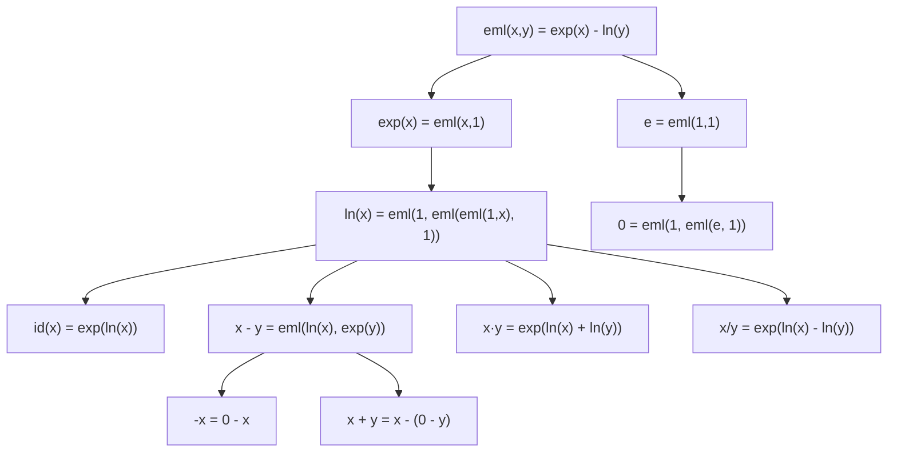

# EML Primer

A practical guide to the EML function for developers working on this codebase.

## Definition

$$\operatorname{eml}(x, y) = e^x - \ln y$$

Two fundamental operations — exponential and natural logarithm — combined with subtraction. That's the entire definition.

Paper: [arxiv.org/abs/2603.21852v2](https://arxiv.org/abs/2603.21852v2) by Andrzej Odrzywołek.

## Why It Matters

**EML is the NAND gate of continuous mathematics.** Just as NAND gates can build any digital circuit, EML can express any elementary function (exp, ln, sin, cos, sqrt, +, -, ×, ÷, powers...) by nesting it with the constant `1`.

The grammar is trivial:

$$S \to 1 \mid \operatorname{eml}(S, S)$$

Every mathematical formula becomes a binary tree where leaves are `1` (or input variables) and every internal node is `eml`.

## Building Blocks

### From EML to everything

| Function | EML expression | RPN | K-complexity |
|----------|---------------|-----|-------------|
| $e$ (constant) | $\operatorname{eml}(1, 1)$ | `11E` | 3 |
| $e^x$ | $\operatorname{eml}(x, 1)$ | `x1E` | 3 |
| $\ln x$ | $\operatorname{eml}(1, \operatorname{eml}(\operatorname{eml}(1,x), 1))$ | `11xE1EE` | 7 |
| $x$ (identity) | $e^{\ln x}$ via EML | `11x1EE1EE` | 9 |
| $-x$ (negation) | nested construction | — | 15 |
| $x \cdot y$ | $\exp(\ln x + \ln y)$ via EML | — | ~19-27 |
| $x + y$ | $x - (0 - y)$ via EML | — | ~27-41 |

### Derivation chain

## Expression Trees

Every EML expression is a full binary tree. The number of distinct trees with $n$ internal `eml` nodes follows the **Catalan numbers**:

$$C_n = \frac{1}{n+1}\binom{2n}{n}$$

| Nodes (n) | Trees ($C_n$) | With 3 leaf types |
|-----------|--------------|-------------------|
| 0 | 1 | 3 |
| 1 | 1 | 9 |
| 2 | 2 | 54 |
| 3 | 5 | 405 |

**K-complexity**: The leaf count of the shortest EML tree for a function. Always odd (since each `eml` node adds 2 children). Simpler functions have smaller K.

## RPN (Stack) Notation

EML programs are written as compact strings:

- `1` — push constant 1.0
- `x`, `t`, `i` — push variable
- `E` — pop two values, push `eml(second, top)` (second = exp arg, top = ln arg)

Examples: `11E` = $e$, `x1E` = $e^x$, `11xE1EE` = $\ln x$

## Numerical Concerns

### Exponential blowup

Nested `exp` grows extremely fast:

| Expression | Value |
|-----------|-------|
| $e^1$ | 2.718 |
| $e^e$ | 15.15 |
| $e^{e^e}$ | 3,814,279 |
| $e^{e^{e^e}}$ | Overflows float64 |

**Mitigation**: `safeEvaluate()` clamps exp input (default: ±500 for general use, ±10 for bullet patterns). Never returns NaN for finite inputs.

### Extended reals

The completeness proof requires IEEE 754 extended reals:
- `ln(0) = -Infinity`
- `exp(-Infinity) = 0`

JavaScript/TypeScript supports this natively.

### NaN propagation

NaN enters via `exp(∞) - ln(∞)` = `∞ - ∞ = NaN`. The `safeEml()` and `safeEvaluate()` functions prevent this by clamping inputs.

### Complex numbers

Trig functions (sin, cos) require complex intermediates via Euler's formula. The current codebase operates in real numbers only — complex support is a future consideration.

## Gradients

$$\frac{\partial \operatorname{eml}}{\partial x} = e^x, \quad \frac{\partial \operatorname{eml}}{\partial y} = -\frac{1}{y}$$

The exp-side gradient explodes for large x. The ln-side gradient explodes near y=0. This makes training EML trees with gradient descent challenging — requires careful clamping and learning rate scheduling.
